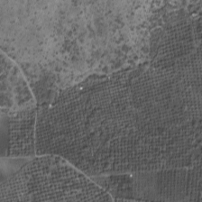

# image-segmentation-cluster

## Parallel Satellite Image Segmentation on Beowulf Cluster using MPI

Satellite Image processing is a very computationally intensive task. To perform it on a single host takes huge processing time which is why a Cluster is used for parallel satellite image processing.

### Beowulf Cluster

A [Beowulf Cluster](https://www-users.cs.york.ac.uk/~mjf/pi_cluster/src/Building_a_simple_Beowulf_cluster.html) is developed which consists of one master node and one slave node. There is a shared file storage developed using Network File System (NFS) where the input satellite image is sent by client. 

Image segmentation is performed on a satellite image consisting of land area and crop area. The aim is to filter out the crop area which can be used for further data analytics.

### Requirements

It is preferable to create an environment in Anaconda and run the code on the cluster. The Conda environment could be created on the Network File System which would automatically propogate all libraries to each node in the cluster.

The MPI library, **mpi4py** can be installed in your created environment using the following line:

```bash
$ conda install -c anaconda mpi4py
```

The keras library that is used to import the pre-trained model, **segmentation-models** is installed using the following line:

```bash
$ pip3 install segmentation-models
```

Other libraries are also used which can be installed using conda: keras, cv2, matplotlib, numpy and pillow.

### Image Preprocessing

This is a preview of the sample satellite image (inp.tif) of dimensions: 13244 x 14276 pixels. (size ≈ 700 MB) 

 

This image is preprocessed by master node dividing it into many smaller chunks of images (224 x 224 pixels). For dividing the image into perfectly (224 x 224 pixel blocks), the satellite image is appended with pixels. The appends are made using pixels with value 255. Appropriate number of columns with pixel values of 255 are added to the right of the above image and appropriate number of rows are added to the bottom of the above image. The preprocessed images are stored in the [input_images](input_images) folder. 

   

Master and slave parallely perform image segmentation on all these smaller images and then the output images are clubbed back to form the full segmented image. These images serve as an input to image segmentation module. 

### Image Segmentation

For image segmentation, a pretrained keras model [unet](https://github.com/zhixuhao/unet "Keras Model - unet") is used. This model takes input of 224x224 pixel images only, which is why preprocessing was required. Image segmentation is done on the Preprocessed images (here ≈ 3840 images), half of which are taken care by the Master and other half by the slave. Output images similar to these images are generated:

  

Note: Output images don't correspond to the outputs of the above input images. (I'll update so as to correspond these images soon.)

The white area here, represents the crop area. All these images finally combined to form the whole satellite image.

